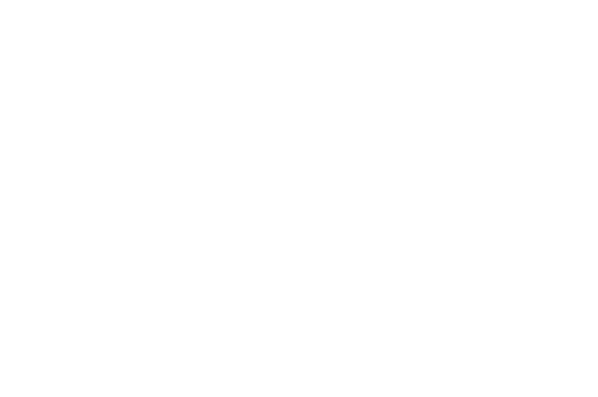

<p align="center">
  
</p>

# Ákritas

Ákritas es una plataforma autónoma de respuesta a incidentes para aplicaciones desplegadas en producción. Observa logs de runtime, detecta y agrupa errores de forma determinística, investiga su causa con IA local y convierte el resultado en trabajo auditable dentro de GitHub.

El objetivo no es reemplazar al equipo: Ákritas automatiza la recolección de evidencia y la propuesta de una solución, mientras mantiene la decisión de merge y despliegue en manos de una persona.

## Qué hace

El ciclo de un incidente es el siguiente:

1. Consulta los logs de una aplicación en Dokploy.
2. Detecta anomalías y agrupa eventos relacionados en un incidente.
3. Reúne evidencia operativa y contexto acotado del repositorio.
4. Investiga la causa raíz con QVAC, ejecutado localmente.
5. Crea siempre una Issue en GitHub como registro canónico.
6. Cuando la corrección es segura y verificable, prepara el cambio y abre una Pull Request.
7. Deja el merge y el despliegue sujetos a revisión humana.

### Principios del proyecto

- **Privacidad por diseño:** logs, código y contexto operativo no se envían a proveedores externos de IA.
- **Detección antes de inferencia:** QVAC no procesa cada línea ni decide qué constituye un error; recibe incidentes ya normalizados.
- **Trazabilidad:** cada incidente conserva evidencia, conclusiones, operaciones y estado de publicación.
- **Automatización con límites:** Ákritas no hace auto-merge ni despliega automáticamente.
- **Credenciales protegidas:** los secretos se almacenan cifrados y no forman parte del contexto enviado al modelo.

## Arquitectura

| Componente | Tecnología | Responsabilidad |
| --- | --- | --- |
| Backend | Go 1.26, Chi y arquitectura hexagonal | API REST, autenticación, monitoreo, incidentes, investigación e integraciones |
| Frontend | Next.js 16, React 19 y TypeScript | Configuración, operación y seguimiento de incidentes |
| Persistencia | PostgreSQL 18 | Estado de dominio, configuración y credenciales cifradas |
| Inferencia | QVAC con API compatible con OpenAI | Investigación local y uso controlado de herramientas de lectura |
| Integraciones | GitHub y Dokploy | Código, Issues, Pull Requests, proyectos y logs de runtime |

```text
Dokploy ──logs──> motor de detección ──> incidente + evidencia
                                              │
                                              v
GitHub <──Issue/PR── backend de Ákritas <── QVAC local
                         │
                         v
                      frontend
```

La especificación detallada se encuentra en [`docs/spec.md`](docs/spec.md), y las decisiones estructurales en [`docs/backend-architecture.md`](docs/backend-architecture.md) y [`docs/frontend-architecture.md`](docs/frontend-architecture.md).

## Requisitos

Para ejecutar el stack local necesitás:

- Git;
- Docker con Docker Compose;
- Node.js 20 o superior y pnpm;
- QVAC CLI con el modelo definido en [`qvac.config.json`](qvac.config.json) disponible;
- OpenSSL para generar los secretos del entorno local.

Go 1.26 solo es necesario si querés ejecutar o probar el backend fuera de Docker.

## Inicio rápido

Cloná el repositorio:

```bash
git clone https://github.com/Unknowns24/akritas.git
cd akritas
```

Los tres componentes se ejecutan por separado. El orden recomendado es backend, frontend y QVAC.

### 1. Backend y PostgreSQL

El entorno local usa PostgreSQL, el backend y Caddy mediante Docker Compose. Caddy expone la API por HTTPS en `https://localhost:8443` con un certificado local.

Desde la raíz del repositorio:

```bash
cd backend

akritas_master_key="$(openssl rand -base64 32)"
akritas_pagination_secret="$(openssl rand -hex 32)"
akritas_bootstrap_token="$(openssl rand -hex 32)"

umask 077
printf 'AKRITAS_MASTER_KEY=%s\nAKRITAS_PAGINATION_SECRET=%s\nAKRITAS_BOOTSTRAP_TOKEN=%s\n' \
  "$akritas_master_key" \
  "$akritas_pagination_secret" \
  "$akritas_bootstrap_token" > app.env

printf 'Guardá este bootstrap token para crear el administrador: %s\n' \
  "$akritas_bootstrap_token"

unset akritas_master_key akritas_pagination_secret akritas_bootstrap_token
docker compose -f docker-compose.local.yml up --build -d
```

Comprobá que la API responda:

```bash
curl --insecure https://localhost:8443/api/v1/auth/setup-status
```

Comandos útiles:

```bash
# Ver logs
docker compose -f docker-compose.local.yml logs -f akritas

# Detener el stack sin borrar la base de datos
docker compose -f docker-compose.local.yml down

# Detenerlo y borrar los volúmenes locales
docker compose -f docker-compose.local.yml down --volumes
```

> `backend/app.env` contiene secretos locales y está ignorado por Git. No lo reutilices en producción ni lo agregues al repositorio. [`backend/.env.example`](backend/.env.example) contiene la referencia completa de variables disponibles.

#### Backend fuera de Docker

Si necesitás ejecutar Go de forma nativa, levantá solo PostgreSQL, copiá la plantilla, reemplazá todos los valores `REPLACE_*` y mantené `AKRITAS_DATABASE_URL` apuntando a `127.0.0.1:55432`:

```bash
cd backend
docker compose -f docker-compose.local.yml up -d postgres
cp .env.example app.env
# Editá app.env antes de continuar.
go mod download
go run ./cmd
```

El servidor escucha en `http://localhost:8080`. Consultá [`docs/configuration.md`](docs/configuration.md) para conocer las variables, restricciones de seguridad y valores opcionales.

### 2. Frontend

El repositorio ya incluye la configuración local para consumir la API a través de Caddy. En otra terminal:

```bash
cd frontend
corepack enable
pnpm install --frozen-lockfile
pnpm dev
```

Abrí [http://localhost:3000](http://localhost:3000). En el primer acceso, completá el alta del administrador con el bootstrap token generado durante el arranque del backend y configurá TOTP con tu aplicación de autenticación.

Las variables disponibles están documentadas en [`frontend/.env.example`](frontend/.env.example). Si ejecutás el backend nativamente, ajustá `NEXT_PUBLIC_API_URL` y `AKRITAS_API_PROXY_TARGET` en `frontend/.env.local`.

### 3. QVAC

Desde la raíz del repositorio, iniciá el servidor compatible con OpenAI usando la configuración incluida:

```bash
qvac serve openai \
  --config qvac.config.json \
  --host 0.0.0.0 \
  --port 11434 \
  --allow-unauthenticated
```

El archivo configura el alias de modelo `akritas`, precarga `QWEN3_8B_INST_Q4_K_M`, habilita tools y usa una ventana de contexto de `32768` tokens.

Una vez autenticado en Ákritas, entrá a **Settings → QVAC** y guardá:

| Campo | Backend en Docker | Backend nativo |
| --- | --- | --- |
| Endpoint | `http://host.docker.internal:11434/v1` | `http://127.0.0.1:11434/v1` |
| Timeout | `180` segundos | `180` segundos |
| Context size | `32768` | `32768` |
| Authentication | `None` | `None` |

Usá **Test connection** para validar el acceso. Si el backend corre dentro de Docker, QVAC debe escuchar en una dirección alcanzable desde el contenedor; escuchar únicamente en loopback no es suficiente. En Linux sin Docker Desktop puede ser necesario definir explícitamente el acceso al host o ejecutar el backend de forma nativa.

## Configuración de integraciones

Con el stack iniciado y el administrador creado:

1. Configurá GitHub desde **Settings → GitHub** mediante Personal Access Token o GitHub App.
2. Registrá el servidor de Dokploy desde **Settings → Dokploy**.
3. Validá QVAC desde **Settings → QVAC**.
4. Creá un proyecto vinculando el repositorio de GitHub con la aplicación o fuente Compose de Dokploy.
5. Activá el monitoreo y seguí incidentes, investigaciones y remediaciones desde el dashboard.

Las responsabilidades y límites de cada proveedor están explicados en [`docs/integrations.md`](docs/integrations.md).

## Desarrollo y validación

### Backend

```bash
cd backend
go test ./...
.harness/kernel/scripts/check-backend-architecture.sh
.harness/kernel/scripts/check-openapi.sh
.harness/kernel/scripts/check-security.sh
```

Los tests de integración que usan Testcontainers requieren Docker activo.

### Frontend

```bash
cd frontend
pnpm lint
pnpm test
pnpm build
.harness/kernel/scripts/check-frontend-architecture.sh
```

## Cómo contribuir

Las contribuciones son bienvenidas. Antes de empezar, revisá el [`AGENTS.md` del backend](backend/AGENTS.md) o el [`AGENTS.md del frontend`](frontend/AGENTS.md), según el área que vayas a modificar. El proyecto usa un harness que define arquitectura, seguridad, OpenAPI, TDD y validaciones obligatorias.

Flujo sugerido:

1. Abrí una Issue o comentá una existente para acordar alcance y comportamiento.
2. Hacé un fork y creá una rama descriptiva desde `main`.
3. Conservá la arquitectura existente y tratá `backend/docs/openapi.yaml` como contrato de la API.
4. Agregá o actualizá tests junto con el cambio.
5. Ejecutá las validaciones del componente afectado.
6. Actualizá la documentación si cambia la configuración, el contrato o el comportamiento observable.
7. Abrí una Pull Request pequeña, con contexto, decisiones relevantes y evidencia de las pruebas ejecutadas.

Reglas esenciales:

- no incluyas tokens, contraseñas, cookies, archivos `.env` ni respuestas crudas de proveedores;
- no envíes credenciales, logs sensibles ni código sin sanitizar a QVAC;
- no inventes endpoints o campos fuera del contrato OpenAPI;
- no introduzcas auto-merge ni despliegue automático sin una decisión de arquitectura explícita;
- mantené la Issue de GitHub como registro canónico del incidente.

## Documentación

- [`docs/spec.md`](docs/spec.md): especificación funcional.
- [`docs/domain.md`](docs/domain.md): entidades y conceptos del dominio.
- [`docs/incident-lifecycle.md`](docs/incident-lifecycle.md): ciclo de vida de un incidente.
- [`docs/integrations.md`](docs/integrations.md): integración con GitHub, Dokploy y QVAC.
- [`docs/agent.md`](docs/agent.md): responsabilidades y límites del agente QVAC.
- [`docs/mvp.md`](docs/mvp.md): alcance del MVP.
- [`docs/demo.md`](docs/demo.md): recorrido de demostración.
- [`docs/adr`](docs/adr): decisiones de arquitectura aceptadas.
- [`docs/rfc`](docs/rfc): propuestas y trabajo futuro.

## Licencia

Ákritas se distribuye bajo la [GNU Affero General Public License v3.0](LICENSE). Podés usar, estudiar, modificar y redistribuir el código. Si distribuís una versión modificada, debés mantenerla bajo la misma licencia y ofrecer su código fuente correspondiente; si la versión modificada se utiliza para prestar un servicio a través de una red, sus usuarios también deben poder obtener ese código fuente.

Revisá el texto completo de la licencia para conocer los términos exactos.
