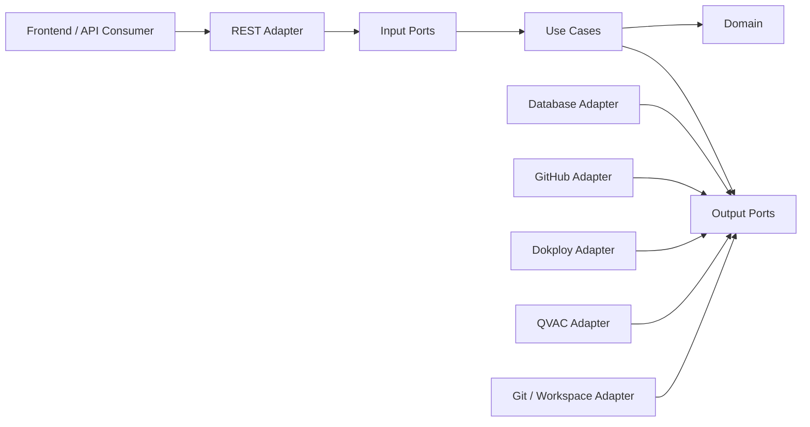
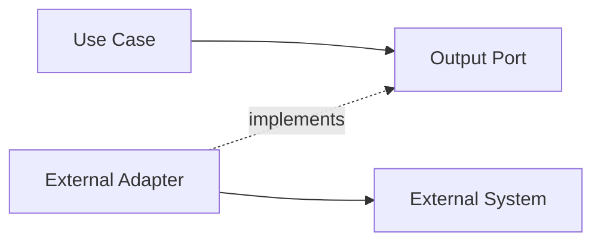
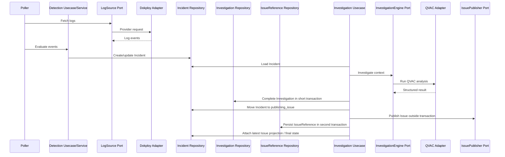

# Akritas — Backend Architecture

## 1. Purpose

This document defines the architectural conventions for the Akritas backend so that every developer can understand how the application is organized, where each responsibility belongs, and which dependency directions are allowed.

The backend is implemented in **Go** and follows **Hexagonal Architecture (Ports & Adapters)**.

The main objective is to keep business behavior independent from transport, persistence, external providers, and infrastructure details. Akritas integrates with systems such as Dokploy, GitHub, QVAC, Git repositories and the local filesystem; these integrations must remain replaceable and must not leak into the application core.

This document complements the AI harness. The harness enforces architectural rules automatically; this document explains those rules for human developers.

---

## 2. Architectural principles

The backend follows these principles:

1. **The domain is independent from infrastructure.**
2. **Use cases express application behavior.**
3. **Ports describe capabilities required or exposed by the application.**
4. **Adapters translate between Akritas and external technologies.**
5. **Dependencies always point toward the application core.**
6. **Each module and file should have one clear responsibility.**
7. **External integrations are infrastructure concerns, not domain concerns.**
8. **Long-running processes must be retry-safe and idempotent where applicable.**
9. **The OpenAPI contract is the source of truth for the HTTP API.**
10. **Database evolution is explicit and versioned through migrations.**

---

## 3. High-level architecture



The important rule is not the physical position in the diagram, but the **direction of source-code dependencies**:

```text
adapters → usecases → core
```

Infrastructure knows about application contracts. The application core does **not** know about infrastructure implementations.

---

## 4. Expected project structure

The reference structure is:

```text
cmd/
  main.go

config/

internal/
  core/
    domain/
    ports/
      in/
      out/
      paging/

  usecase/

  service/

  adapter/
    db/
      <technology>/
        migrations/
          migrate.go
          schema/
          data/
        repository/

    external/
      github/
      dokploy/
      qvac/
      git/

    rest/
      dto/
        common/
        <feature>/
      handler/
      middleware/
      router/
      swagger/ or docs/

docs/
  architecture/
  openapi.yaml
```

Not every directory must exist from day one. Directories should be introduced only when a real responsibility requires them.

---

## 5. The core

`internal/core` contains the most stable part of the application.

It must not depend on:

- Chi;
- `net/http` transport concerns;
- GORM;
- SQL drivers;
- GitHub SDKs;
- Dokploy clients;
- QVAC HTTP clients;
- filesystem implementations;
- `os/exec` or Git CLI execution;
- concrete adapters.

### 5.1 Domain

Location:

```text
internal/core/domain/
```

The domain contains the concepts and rules that exist because Akritas exists, not because a particular library or provider exists.

Typical Akritas concepts include:

- `Project`;
- `MonitoringConfiguration`;
- `LogEvent`;
- `Incident`;
- `Investigation`;
- GitHub repository references;
- Dokploy application references;
- investigation and remediation states.

Domain objects may contain invariants and behavior when that behavior belongs naturally to the entity or value object.

The domain must not contain HTTP DTOs, GORM repository logic, GitHub payloads or
QVAC response structures. Persistible domain entities may declare passive GORM
field tags when an accepted ADR authorizes direct persistence; they must not
import GORM or contain persistence behavior.

### 5.2 Input ports

Location:

```text
internal/core/ports/in/
```

Input ports describe operations that the application exposes to its callers.

Examples:

```text
CreateProject
UpdateMonitoringConfiguration
ListIncidents
GetIncident
InvestigateIncident
RetryInvestigation
```

REST handlers, scheduled processes or other entrypoints should call application behavior through these contracts when applicable.

### 5.3 Output ports

Location:

```text
internal/core/ports/out/
```

Output ports describe capabilities that the application needs from the outside world.

They must describe **Akritas capabilities**, not mirror provider SDKs.

Good examples:

```text
ProjectRepository
IncidentRepository
LogSource
InvestigationEngine
IssuePublisher
RepositoryWorkspace
ChangePublisher
```

Avoid designing a port by copying all methods from a GitHub or Dokploy client.

A useful rule is:

> The core defines what Akritas needs. The adapter decides how a provider satisfies it.

---

## 6. Use cases

Location:

```text
internal/usecase/<feature>/
```

Use cases coordinate application behavior.

They may:

- load domain objects through repository ports;
- validate application rules;
- invoke domain behavior;
- call external capabilities through output ports;
- persist resulting state;
- coordinate application-level transactions.

They must **not** know how GitHub, Dokploy, QVAC, GORM or Git CLI work internally.

### Example

Conceptually, an incident investigation use case may do this:

```text
Load incident
   ↓
Load project configuration
   ↓
Ask InvestigationEngine to analyze it
   ↓
Apply result to Investigation domain state
   ↓
Persist result
```

The use case should not construct an HTTP request to QVAC itself.

---

## 7. Services

Location:

```text
internal/service/<feature>/
```

Services are optional.

Use a service when there is cohesive, reusable orchestration or application behavior that does not fit naturally inside a domain entity and should not make a use case excessively large.

A service must not become a generic place for unrelated logic.

Prefer:

```text
service/detection/
service/remediation/
```

over:

```text
service/service.go
```

with dozens of unrelated methods.

---

## 8. Adapters

Adapters implement technical details at the system boundary.

There are three major adapter groups in Akritas:

```text
REST
Database
External systems
```

### 8.1 REST adapter

Location:

```text
internal/adapter/rest/
```

The REST layer is responsible for transport only.

Handlers should:

1. read path/query/body input;
2. perform transport-level validation;
3. map DTOs to application input;
4. invoke a use case/input port;
5. map application output to response DTOs;
6. map known errors to HTTP responses.

Handlers must remain thin.

They must not contain business rules, direct GORM queries or provider-specific integrations.

REST contract structs use the `DTO` suffix, one struct per file and feature
packages under `dto/<feature>/`; shared envelopes live under `dto/common/`.
Conversions between transport DTOs and application/domain values live in
`internal/adapter/rest/mapper/`, with one mapping responsibility per file.

Recommended structure:

```text
internal/adapter/rest/handler/
  project/
    handler.go
    create.go
    get.go
    list.go
    update.go

  incident/
    handler.go
    get.go
    list.go
    investigate.go
```

### 8.2 Database adapter

Location:

```text
internal/adapter/db/<technology>/
```

Database repositories implement output ports defined by the core.

When GORM is used, executable GORM dependencies, queries and repository behavior
belong here and not in domain/usecase layers. Passive GORM tags on persistible
domain entities are the narrow exception documented by ADR-012.

Recommended repository structure:

```text
repository/
  incident/
    repo.go
    create.go
    get_by_id.go
    list.go
    update.go
```

Each operation should normally live in its own file.

### 8.3 External adapters

Location:

```text
internal/adapter/external/
```

Akritas depends heavily on integrations, so this boundary is especially important.

Expected examples:

```text
internal/adapter/external/github/
internal/adapter/external/dokploy/
internal/adapter/external/qvac/
internal/adapter/external/git/
```

Provider DTOs, SDK types and HTTP payloads must stay inside the corresponding adapter.

Adapters translate them into domain/application types at the boundary.

---

## 9. Akritas external integration boundary

The following dependency is correct:



Examples:

```text
Usecase → LogSource → Dokploy Adapter → Dokploy API
Usecase → InvestigationEngine → QVAC Adapter → QVAC
Usecase → IssuePublisher → GitHub Adapter → GitHub
Usecase → RepositoryWorkspace → Git Adapter → local git/filesystem
```

The following is forbidden:

```text
usecase → github.Client
usecase → custom Dokploy http.Client
usecase → exec.Command("git", ...)
usecase → os.ReadFile(repositoryPath)
```

This rule allows integrations to be tested, replaced and evolved independently.

---

## 10. Background and long-running processes

Akritas contains workflows that do not naturally belong to a request/response lifecycle.

Examples:

```text
Poll Dokploy logs
Detect errors
Group occurrences
Create/update Incident
Investigate with QVAC
Create GitHub Issue
Attempt remediation
Create Pull Request
```

These processes should use the same application ports/use cases as other entrypoints where practical.

### Required properties

Background processes should be designed with the following properties:

- **Idempotency:** retrying an operation should not create invalid duplicates.
- **Retry awareness:** failures from GitHub, Dokploy or QVAC are expected operational states.
- **Explicit state transitions:** progress should be represented in persisted domain/application state when needed.
- **No long database transactions around network calls.**
- **No hidden side effects inside repository methods.**
- **Cancellation/timeouts:** external calls should respect bounded execution when applicable.
- **Observability:** failures should be diagnosable without exposing secrets.

### Example

Do not keep a database transaction open while waiting for QVAC:

```text
BAD
BEGIN TX
  load incident
  call QVAC for several seconds/minutes
  save investigation
COMMIT
```

Prefer discrete persistence boundaries:

```text
load required state
mark investigation as running
persist

call QVAC

persist completed/failed result
```

---

## 11. Incident processing flow

A simplified architectural flow is:



This diagram shows responsibilities, not necessarily goroutines, queues or deployment topology. External GitHub calls are never made inside PostgreSQL transactions; the durable IssueReference is the idempotency boundary for one Issue per completed Investigation, while Incident detail projects only the most recent Issue.

---

## 12. Modularity and SRP

Akritas follows strict feature-oriented modularity.

A package should represent a cohesive feature or responsibility.

A file should normally expose at most one independent public operation.

### Use cases

Prefer:

```text
internal/usecase/project/
  uc.go
  create.go
  get.go
  list.go
  update.go
```

Do not create:

```text
internal/usecase/project.go
```

containing every project operation.

### Repositories

Prefer:

```text
repository/incident/
  repo.go
  create.go
  get_by_id.go
  list.go
  update.go
```

### REST handlers

Prefer:

```text
handler/incident/
  handler.go
  get.go
  list.go
  retry_investigation.go
```

This keeps changes localized and reduces conflicts when multiple developers work in parallel.

---

## 13. Wiring and dependency injection

The composition root is normally:

```text
cmd/main.go
```

or a dedicated bootstrap package if the project later requires one.

Dependencies should be created in this general order:

```text
config
  ↓
database + migrations
  ↓
repositories
  ↓
external adapters
  ↓
services
  ↓
use cases
  ↓
REST router / background entrypoints
```

Constructors should receive dependencies explicitly.

Typical conventions:

```go
func NewXUseCase(...) in.XUseCase
func NewXRepository(...) out.XRepository
func NewXAdapter(...) out.XAdapter
func NewXService(...) in.XService
```

Do not instantiate repositories or provider clients inside use cases or handlers.

---

## 14. Database and migrations

When persistence uses GORM:

- repositories use GORM inside the DB adapter;
- repositories may persist tagged domain entities directly when ADR-012 applies;
- adapter-private storage records remain appropriate for non-domain data such as
  encrypted Credential Store rows;
- schema/data evolution uses `github.com/go-gormigrate/gormigrate/v2`;
- startup-wide `AutoMigrate` is not the migration strategy;
- every persistent change must have an ordered versioned migration.

Expected structure:

```text
internal/adapter/db/<technology>/migrations/
  migrate.go
  schema/
  data/
```

Migration ID convention:

```text
YYYYMMDD_NN_<snake_case_description>
```

Examples:

```text
20260822_01_add_projects
20260822_02_add_incidents
20260822_10_backfill_monitoring_configuration
```

Schema migrations normally use slots `01-09`; data migrations use `10+` for the same date.

Applied migrations are immutable. A new change requires a new migration.

---

## 15. API contract

For the HTTP backend, OpenAPI is the contract between backend and frontend.

The canonical contract should live in the project-defined OpenAPI location, preferably:

```text
docs/openapi.yaml
```

The contract defines:

- endpoints;
- request DTOs;
- response DTOs;
- authentication;
- error envelopes;
- pagination;
- documented permissions.

When adding a full-stack feature, the desired sequence is:

```text
Domain/application behavior
   ↓
API contract
   ↓
Backend implementation
   ↓
Frontend consumption
```

The frontend must not infer undocumented payloads from backend internals.

---

## 16. Errors

Domain/application errors should be meaningful at the application boundary and independent from HTTP.

Examples of concerns:

```text
not found
conflict
invalid state transition
validation/business rule failure
external dependency failure
unauthorized operation
```

The REST adapter maps known application errors to appropriate HTTP responses.

The shared enriched error type does not centralize ownership: REST, database and
external-provider sentinels are declared in their respective adapters; only
domain and use-case errors live in core.

Provider-specific errors should be normalized inside their adapters instead of leaking GitHub/QVAC/Dokploy SDK errors throughout the application.

Raw infrastructure errors, tokens and sensitive provider payloads must not be exposed to API consumers.

---

## 17. Pagination

For operational list endpoints, use `github.com/unknowns24/uker/pagination` as the
single cursor implementation. REST parses with `ParseWithSecurity`, database
adapters apply `Apply`/`ApplyFilters`, and REST builds responses with
`BuildPageSigned`. External discovery adapters translate Uker boundaries to
provider page/offset values without defining a second cursor codec.

Backend-owned filters such as authenticated scopes should not be client-overridable.

If a cursor encodes filters/sort/limit, subsequent cursor requests must preserve that state.

Provider-native offsets may exist behind an adapter, but public endpoints must not
introduce a second offset pagination contract.

---

## 18. Testing strategy by boundary

Tests should follow architectural responsibilities.

### Domain tests

Test invariants and state transitions without infrastructure.

### Use case tests

Use fakes/stubs for output ports.

A use case that requires GitHub or Dokploy should be testable without a real GitHub/Dokploy connection.

### Adapter tests

Test mapping, provider behavior and infrastructure integration separately.

### Repository/migration tests

Use integration tests where persistence behavior is relevant, especially for:

- complex queries;
- constraints;
- backfills;
- schema transitions;
- risky migrations.

### REST tests

Validate transport concerns:

- parsing;
- status codes;
- DTOs;
- error mapping;
- auth/middleware behavior.

---

## 19. Forbidden patterns

The following patterns should be treated as architecture violations:

```text
core/domain → GORM imports or repository behavior
core/usecase → GitHub SDK
core/usecase → Dokploy/QVAC HTTP client
core/usecase → os/exec
REST handler → GORM
REST handler → concrete repository
REST DTO used as domain model
GORM model returned directly as HTTP response
repository method triggering GitHub/QVAC calls
provider DTO stored throughout the domain
large generic services/repositories/handlers with unrelated operations
```

---

## 20. Where should new code go?

Use this decision guide.

| Question | Location |
|---|---|
| Is this a business/domain concept or invariant? | `internal/core/domain` |
| Is this an operation Akritas exposes? | `internal/core/ports/in` + `internal/usecase` |
| Is this a capability Akritas needs from infrastructure? | `internal/core/ports/out` |
| Is this reusable application orchestration? | `internal/service/<feature>` |
| Does it talk to the database? | `internal/adapter/db/...` |
| Does it talk to GitHub/Dokploy/QVAC/Git/filesystem? | `internal/adapter/external/...` |
| Is it HTTP parsing/response mapping? | `internal/adapter/rest/...` |
| Does it wire concrete dependencies? | composition root (`cmd/main.go` / bootstrap) |

---

## 21. Authentication boundary

Authentication is a cross-cutting backend capability, not a REST-only business
rule and not a generic enterprise identity platform.

The MVP modules should remain cohesive:

```text
core/domain authentication concepts
        ↓
auth usecases (setup, verify, login, logout, recovery)
        ↓
session and encrypted-secret output ports
        ↓
database / cryptography adapters
        ↓
REST auth handlers and session middleware
```

Rules:

- exactly one active Administrator;
- passwords are Argon2id hashes, never reversible encryption;
- TOTP seeds are encrypted at rest and only decrypted at verification time;
- session tokens are random, opaque and persisted only in non-reversible form;
- setup/recovery compare the environment bootstrap token in constant time;
- login and recovery enforce independent per-account and per-IP rate limits;
- authentication failures expose one generic public error;
- session middleware injects authenticated identity; handlers never parse storage
  records directly;
- mutating browser requests validate Origin against configured same-site origins.

GitHub callbacks are intentionally public HTTP endpoints, but every attempt uses a
stored, expiring, one-time `state`. Callback payloads are validated before any
credential is persisted or redirect is emitted.

## 22. HTTP contract conventions

The canonical contract is `backend/docs/openapi.yaml` and declares API version
`1.2.0` under `/api/v1`.

Transport conventions:

```text
single resource  → { data: object }
collection       → { data: [], paging: {...} }
long command     → 202 { data: Operation }
failure          → { error: { code, message, user_message, request_id, details? } }
```

Operational collections use signed cursors. A request with `cursor` must not add
or change filters, sort or limit. Manual investigation, remediation and PR
commands require `Idempotency-Key`.

OpenAPI response schemas must never contain integration credentials, auth secrets
or session tokens. Enrollment provisioning data is a one-time response with
`Cache-Control: no-store`, not a persisted public resource.

Incident `phase = completed` means Akritas completed its workflow. It does not
mean the production defect was merged, deployed or resolved.

## 23. Final rule

When deciding where code belongs, ask:

> If we replaced HTTP, the database, GitHub, Dokploy or QVAC tomorrow, would this code still represent an Akritas rule or application behavior?

If the answer is **yes**, it probably belongs toward the core/usecase side.

If the answer is **no**, it probably belongs in an adapter.
