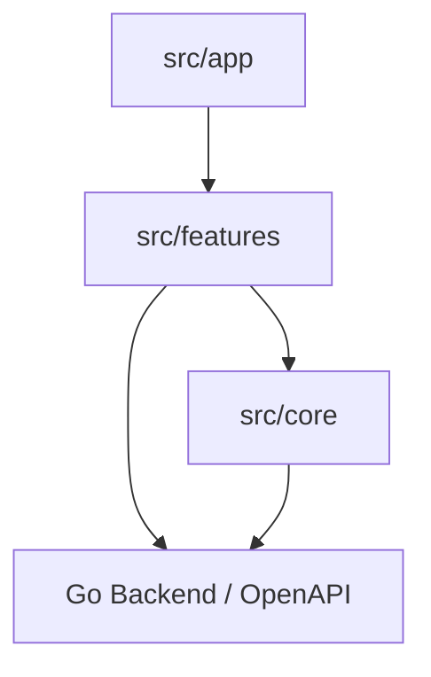
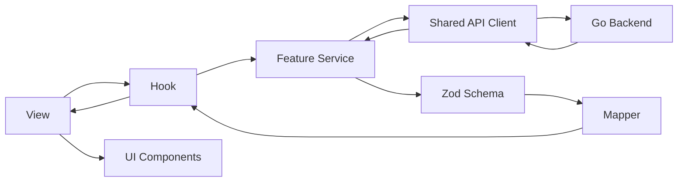
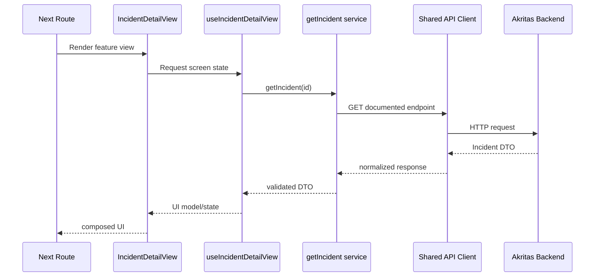

# Akritas — Frontend Architecture

## 1. Purpose

This document defines the architecture of the Akritas frontend so that every developer understands how routes, features, shared code, backend contracts and UI responsibilities are organized.

The frontend is implemented with:

- **Next.js App Router**;
- **TypeScript**;
- **feature-based architecture**;
- **CSS Modules** for custom styles;
- **Zod** for runtime validation where relevant;
- a shared API client for communication with the Go backend.

This document complements the AI harness. The harness provides automated constraints; this document explains the architecture and intended development model for humans.

---

## 2. Architectural principles

The frontend follows these principles:

1. **Features are the main unit of product organization.**
2. **`src/app` only owns Next.js routing and framework concerns.**
3. **`src/core` contains truly shared cross-feature code.**
4. **Features consume core, never the opposite.**
5. **A feature exposes a deliberate public API through `index.ts`.**
6. **The OpenAPI document is the source of truth for backend data contracts.**
7. **Services perform network communication; UI components do not know endpoints.**
8. **Server Components are preferred unless browser interactivity is required.**
9. **Secrets and integration credentials never reach browser code.**
10. **Each component/hook/service/file should have a focused responsibility.**

---

## 3. High-level architecture



Allowed dependency direction:

```text
app → features → core
features → core
core → no features
```

The key rule is:

> `core` must never depend on a product feature.

---

## 4. Expected project structure

```text
src/
  app/
  core/
  features/
```

A more complete example for Akritas could look like:

```text
src/
  app/
    (private)/
      projects/
      incidents/
      settings/
    layout.tsx

  core/
    auth/
    config/
    errors/
    libs/
      api-client/
    routes/
    ui/

  features/
    projects/
    incidents/
    investigations/
    settings/
```

The exact feature names may evolve with the product backlog. The architectural rules remain the same.

---

## 5. `src/app` — routing layer

`src/app` exists for Next.js routing and framework files.

Typical responsibilities:

- `page.tsx`;
- `layout.tsx`;
- `loading.tsx`;
- `error.tsx`;
- `not-found.tsx`;
- route groups such as `(public)` and `(private)`;
- route metadata and framework-level composition.

### App must remain thin

A route should normally render a feature view:

```tsx
import { IncidentsListView } from "@/features/incidents";

export default function Page() {
  return <IncidentsListView />;
}
```

Do not place inside `page.tsx`:

- complex forms;
- business rules;
- large tables;
- backend contract mapping;
- ad-hoc API calls;
- feature-specific state orchestration.

Those responsibilities belong to the feature.

---

## 6. `src/core` — shared foundation

`src/core` contains code that is reused across multiple features and is not owned by a single product capability.

Suggested structure:

```text
src/core/
  auth/
  config/
  errors/
  libs/
  routes/
  ui/
```

Examples of appropriate core concerns:

- shared API client;
- application runtime configuration;
- authentication/session utilities;
- global error normalization;
- route builders;
- buttons, modals, badges and other generic UI primitives;
- common formatters used across several features.

### Core dependency rule

This is forbidden:

```text
core → features/incidents
```

If a supposedly generic component needs to import an Incident type or a Project-specific hook, it is probably not generic and should live in that feature.

---

## 7. `src/features` — product capabilities

Each product capability is represented as a feature.

Standard structure:

```text
src/features/<feature>/
  index.ts
  views/
  components/
  composites/
  hooks/
  services/
  schemas/
  types/
  mappers/
  context/
  storage/
  utils/
```

Only create directories that are actually needed.

### Example: incidents

```text
src/features/incidents/
  index.ts

  views/
    IncidentsListView/
      index.tsx
      IncidentsListView.module.css
      useIncidentsListView.ts

    IncidentDetailView/
      index.tsx
      IncidentDetailView.module.css
      useIncidentDetailView.ts

  components/
    IncidentSeverityBadge.tsx
    IncidentStatusBadge.tsx

  composites/
    IncidentEvidencePanel.tsx
    IncidentTimeline.tsx

  hooks/
    useRetryInvestigation.ts

  services/
    list-incidents.service.ts
    get-incident.service.ts
    retry-investigation.service.ts

  schemas/
    incident.schemas.ts

  types/
    incident.types.ts

  mappers/
    incident.mapper.ts
```

---

## 8. Feature public API

Every feature exposes its intentional public surface through:

```text
src/features/<feature>/index.ts
```

Correct:

```ts
import { IncidentDetailView } from "@/features/incidents";
```

Avoid:

```ts
import { IncidentDetailView } from "@/features/incidents/views/IncidentDetailView";
```

The second form couples consumers to the internal layout of the feature.

A feature should export only what other modules are intentionally allowed to consume.

---

## 9. Cross-feature dependencies

Features must not casually import internals from other features.

Forbidden:

```ts
import { IncidentStatusBadge } from "@/features/incidents/components/IncidentStatusBadge";
```

from another feature.

When two features need the same capability, decide based on ownership:

| Shared concern | Preferred location |
|---|---|
| Generic UI | `core/ui` |
| Generic helper | `core/libs` |
| Global auth/session | `core/auth` |
| Route generation | `core/routes` |
| Truly shared product concept | explicit shared boundary after deliberate design |
| Coincidental reuse | keep duplicated temporarily rather than creating a bad abstraction |

Avoid premature abstraction.

---

## 10. Responsibilities inside a feature

A feature is divided by responsibility.

### 10.1 Views

`views/` are route-ready screens.

A view is responsible for:

- screen composition;
- connecting hooks and UI pieces;
- defining the main feature layout.

A view should not contain:

- large inline requests;
- complex DTO mapping;
- transport validation;
- hundreds of lines of unrelated UI sections.

### 10.2 Components

`components/` are small visual units specific to the feature.

They should usually:

- receive data through props;
- render UI;
- emit callbacks/events.

They should not know:

- endpoint URLs;
- OpenAPI implementation details;
- global auth internals;
- provider credentials.

### 10.3 Composites

`composites/` represent larger functional sections built from several components.

Examples in Akritas:

```text
IncidentEvidencePanel
InvestigationSummary
ProjectMonitoringCard
GitHubIntegrationPanel
```

They may handle simple local UI state but should receive prepared data whenever possible.

### 10.4 Hooks

`hooks/` encapsulate state and UI/application orchestration.

A hook may:

- coordinate queries/mutations;
- manage feature state;
- handle browser-side effects;
- expose a simple API to the view.

Do not create a giant hook that manages unrelated requests, permissions, forms and presentation logic.

### 10.5 Services

`services/` perform backend calls.

They should:

- use the shared API client;
- follow `docs/openapi.yaml`;
- return typed DTOs;
- validate important responses when appropriate.

They should not:

- show toasts;
- navigate;
- render components;
- contain UI formatting.

### 10.6 Schemas

`schemas/` contains Zod schemas for:

- backend response validation;
- relevant request validation;
- form validation when useful.

Schemas provide a runtime boundary where TypeScript alone is insufficient.

### 10.7 Types

`types/` contains:

- DTO types;
- UI models;
- enums;
- derived types.

DTOs should use the `Dto` suffix where practical.

### 10.8 Mappers

`mappers/` translates between backend DTOs and UI-friendly models.

Examples:

```text
ISO timestamp → Date/display model
backend enum → UI label/variant
nullable API fields → explicit view model
```

Mappers must not perform network requests.

---

## 11. Frontend data flow

The preferred data flow is:



Not every request needs every step. Use the smallest architecture that preserves clarity.

For a simple response, a separate mapper may be unnecessary. For an Incident detail with multiple states, dates and nested provider data, a mapper is often useful.

---

## 12. OpenAPI as source of truth

The frontend must not invent the backend.

Use:

```text
docs/openapi.yaml
```

as the source of truth for:

- endpoint paths;
- methods;
- request fields;
- response fields;
- errors;
- authentication;
- permissions when documented;
- pagination shape.

Do not:

- guess endpoint names;
- add undocumented request properties;
- infer response fields from database models;
- hide backend/OpenAPI inconsistencies with frontend hacks.

When a contract changes, the intended order is:

```text
Update OpenAPI
   ↓
Update backend implementation
   ↓
Update frontend service/schema/types/UI
```

---

## 13. Shared API client

All feature services should use the shared API client, normally located under:

```text
src/core/libs/api-client/
```

The shared client is the correct place for cross-cutting transport concerns such as:

- base URL;
- authentication/session handling;
- request IDs where applicable;
- standard headers;
- normalized error envelopes;
- session expiration behavior.

Do not create feature-local Axios instances or scatter ad-hoc `fetch()` calls throughout the codebase.

---

## 14. Server Components and Client Components

Akritas uses Next.js App Router.

### Default rule

Prefer **Server Components** when browser-only capabilities are not required.

Use `"use client"` only at the smallest practical interactive boundary.

Client Components are appropriate when the code needs:

- event handlers;
- local interactive state;
- effects;
- browser APIs;
- client-only libraries.

Do not turn an entire route tree into Client Components merely because one button is interactive.

### Example

A page may remain server-rendered while a small action panel is client-side:

```text
IncidentDetailView
├── IncidentSummary            Server-compatible
├── EvidencePanel              Server-compatible
└── InvestigationActions       Client Component
```

The exact data-fetching strategy may evolve, but the client/server boundary should stay intentional.

---

## 15. Secrets and integration configuration

Akritas manages integrations with sensitive systems.

The browser must never receive credentials for:

- GitHub;
- Dokploy;
- QVAC;
- repository access;
- internal services.

Never expose these through:

```text
NEXT_PUBLIC_*
page props
serialized Server Component data
client state
query parameters
localStorage
sessionStorage
browser logs
```

The frontend may receive safe projections such as:

```json
{
  "status": "connected",
  "display_name": "Production Dokploy",
  "account_identifier": "unkcode",
  "can_reconnect": true
}
```

It should not receive the actual secret used to make provider requests.

Provider operations requiring secrets are backend responsibilities.

---

## 16. Runtime environment configuration

Akritas may be built once as a Docker image and deployed into different environments.

Environment-dependent browser configuration should therefore be read through the centralized runtime configuration module, for example:

```text
src/core/config/env.ts
```

When the project uses this deployment model, use `next-runtime-env` rather than scattering build-time `process.env` reads.

Example:

```ts
import { env } from "next-runtime-env";

export const appEnv = {
  apiBaseUrl: env("NEXT_PUBLIC_API_BASE_URL"),
};
```

Features and services should consume `appEnv`, not `process.env` directly.

---

## 17. UI and design system

Akritas should follow its project design document as a visual contract.

Priority:

```text
feature DESIGN.md/design.md
project DESIGN.md/design.md
existing UI patterns
```

The frontend should use centralized design tokens rather than scattered colors and spacing values.

Typical token location:

```text
src/core/ui/theme.css
src/core/ui/tokens.ts
```

Common token concerns:

- surface/background;
- primary;
- text primary/secondary;
- borders;
- semantic success/warning/error/info;
- spacing;
- radii;
- shadows;
- typography;
- z-index/layout values.

Do not introduce a new UI kit or styling system without an explicit architectural/design decision.

---

## 18. Remote-data states

Any section depending on remote data must intentionally consider applicable states:

```text
loading
empty
error
success
restricted / permission denied
disabled
```

For example, an Incidents list should not render a blank table while loading or when the project has never produced an incident.

Settings/integration screens should distinguish states such as:

```text
not configured
connected
unavailable
authentication failed
```

without exposing sensitive infrastructure details.

---

## 19. Tables and operational lists

Akritas is an operational dashboard, so lists need consistent behavior.

For tables/lists:

- provide clear filters;
- show loading, empty and error states;
- use backend/OpenAPI pagination;
- keep actions manageable;
- prefer a row action menu when several actions exist;
- keep repeated concepts such as status/severity visually consistent.

Avoid every feature inventing a different interaction model for operational lists.

---

## 20. Forms

Forms should:

- use visible labels;
- validate the documented contract;
- show clear human-readable errors;
- show submit progress;
- prevent duplicate submissions;
- confirm destructive actions;
- split large configurations into cohesive sections.

Client-side validation improves UX but is not a security boundary. The Go backend remains responsible for authoritative validation.

---

## 21. Error handling

Transport errors should be normalized centrally, usually in:

```text
src/core/errors/
```

or the shared API client.

Feature UI should work with normalized, user-appropriate errors rather than raw provider or HTTP client errors.

Do not show users:

- stack traces;
- GitHub/Dokploy/QVAC raw responses;
- secret values;
- internal hostnames when not intended;
- arbitrary Go error strings.

Preserve useful technical identifiers, such as request IDs, when they are safe and help debugging.

---

## 22. Authentication and permissions

When private/public routing is applicable, route groups may be organized as:

```text
src/app/(public)/
src/app/(private)/
```

Frontend authorization improves UX but is not security.

The frontend may hide or disable actions that the current user cannot execute, but the backend must always enforce permissions independently.

Session-expiration behavior should be centralized through the shared authentication/API infrastructure rather than implemented separately by every feature.

---

## 23. SRP and file size

Each component, hook, service and function should have one clear responsibility.

As a guideline, if a component or view grows beyond roughly **150–200 lines**, evaluate whether responsibilities can be split.

Do not split files mechanically based only on line count. Split when there are distinct responsibilities.

For complex views, prefer a structure like:

```text
IncidentDetailView/
  index.tsx
  IncidentDetailView.module.css
  useIncidentDetailView.ts
  components/
    IncidentHeader.tsx
    IncidentEvidencePanel.tsx
    InvestigationPanel.tsx
    GitHubIssuePanel.tsx
```

The view composes; dedicated pieces own individual concerns.

---

## 24. Naming conventions

Use these conventions unless an existing module has an intentionally different established pattern:

```text
Components      PascalCase.tsx
Hooks           useSomething.ts
Services        *.service.ts
Schemas         *.schemas.ts
Types           *.types.ts
Mappers         *.mapper.ts
Constants       *.constants.ts
CSS Modules     ComponentName.module.css
Views           SomethingView
DTOs            *Dto
Props           *Props
```

Use the `@/` alias for imports from `src`.

Prefer:

```ts
import { Button } from "@/core/ui/components/Button";
```

instead of long relative paths.

---

## 25. Forbidden patterns

Treat the following as architecture violations:

```text
core → feature imports
feature A → internals of feature B
business logic inside page.tsx
ad-hoc API clients per feature
fetch/axios scattered across visual components
service → React component
mapper → network request
schema → navigation/UI behavior
provider credentials in browser state
GitHub/Dokploy/QVAC tokens in NEXT_PUBLIC_*
large Client Component trees without browser requirements
raw backend DTOs directly driving complex visual presentation when mapping is needed
```

---

## 26. Example: Incident detail feature

A possible flow for `/incidents/:id` is:



If a user clicks **Retry investigation**, that mutation should be handled by a dedicated action/hook/service rather than embedding endpoint logic directly in the button component.

---

## 27. Where should new code go?

Use this decision guide.

| Question | Location |
|---|---|
| Is this a Next.js route/framework concern? | `src/app` |
| Is this a product capability/screen? | `src/features/<feature>` |
| Is this UI specific to one feature? | feature `components/` or `composites/` |
| Is this state/orchestration specific to a feature? | feature `hooks/` |
| Is this a backend request for one feature? | feature `services/` |
| Is this runtime validation? | feature `schemas/` |
| Is this DTO-to-view transformation? | feature `mappers/` |
| Is this shared by several features and truly generic? | `src/core` |
| Is this shared transport/auth/config? | `src/core/libs`, `auth`, `config`, etc. |

---

## 28. Authentication routes and session handling

The frontend has three public auth routes:

```text
/setup
/login
/recovery
```

All product routes are private. A centralized auth/session layer calls
`GET /auth/setup-status` before routing an uninitialized installation and
`GET /auth/session` before rendering private application state.

The session identifier is an HttpOnly cookie and is intentionally unavailable to
JavaScript. The shared API client sends same-origin credentials and never mirrors
the cookie into localStorage, sessionStorage, React state, query parameters or
logs.

Setup and recovery must treat `otpauth_uri` and the manual key as one-time
provisioning data:

- render them only on the enrollment screen;
- do not persist them in browser storage or caches;
- clear component state after verification/navigation;
- do not include them in analytics or error reporting.

Authentication forms use the generic error envelope and must not infer which
factor failed. A `429` state shows a generic retry message without remaining
attempt counts.

GitHub App setup leaves Akritas through a browser form POST and returns through
backend callbacks. The frontend never receives private key, webhook secret or
installation token; it only renders the final safe `GitHubAccount` projection.

## 29. Contract-driven operational semantics

- Use `workflow_completed_incidents`, never label a PR-created workflow as a
  production incident “resolved”.
- Poll `Operation` after a `202` response and stop on `succeeded` or `failed`.
- Generate one UUID `Idempotency-Key` per user intent and reuse it only for retries
  of that same command.
- Send filters/sort/limit on the first collection request and only `cursor` on
  subsequent requests.
- Built-in detection rules are read-only. Custom positive/ignored regex patterns
  are the only project-level detection rules editable in the MVP.
- The Automation screen exposes three dependent toggles, while Issue publication
  remains mandatory and absent from the form.

## 30. Final rule

When deciding whether code belongs in `core` or a feature, ask:

> Would this code still make sense if the feature that introduced it disappeared?

If **no**, keep it inside the feature.

If **yes**, and multiple parts of the application genuinely need it, it may belong in `core`.

The goal is not maximum reuse. The goal is **clear ownership, low coupling and predictable change**.
