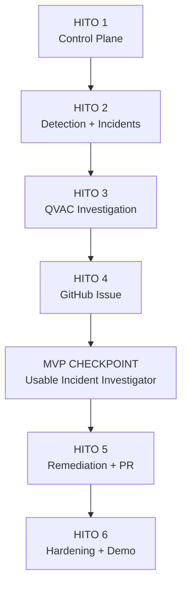

# Akritas — Product Backlog y Plan de Hitos para el MVP

## Propósito

Este documento define el **Product Backlog del MVP de Akritas** y propone una secuencia de ejecución dividida en **hitos incrementales**.

Cada hito representa un incremento funcional, demostrable y testeable del producto. Además, cada uno contiene su correspondiente **Sprint Backlog**, entendido como el subconjunto del Product Backlog que debe completarse para considerar el hito terminado.

El equipo considerado para esta planificación es de **4 developers**.

La prioridad principal de la planificación es llegar al MVP de forma ordenada, manteniendo en todo momento un flujo funcional parcial que pueda demostrarse aun si funcionalidades posteriores todavía no fueron completadas.

---

# 1. Objetivo del MVP

El MVP de Akritas debe demostrar de forma real y end-to-end el siguiente loop:

```text
Configurar GitHub + Dokploy
        ↓
Crear Project
        ↓
Activar Monitoring
        ↓
Leer logs
        ↓
Detectar + agrupar error
        ↓
Crear Incident
        ↓
Investigar con QVAC local
        ↓
Crear GitHub Issue
        ↓
Clasificar como fixable
        ↓
Generar fix
        ↓
Validarlo
        ↓
Crear Pull Request
```

La demostración debe realizarse utilizando integraciones reales con Dokploy, GitHub y una instancia local de QVAC.

El objetivo del MVP no es construir una plataforma de observabilidad completa ni un agente autónomo generalista, sino demostrar de forma confiable el siguiente valor principal:

> Akritas detecta errores reales en ejecución, agrupa sus ocurrencias, investiga la causa utilizando un modelo local, documenta el incidente en GitHub y, cuando existe suficiente confianza para una remediación automática, genera y valida una Pull Request sin realizar merge ni deploy automáticamente.

---

# 2. Principios de planificación

## 2.1 Incrementos verticales

Los hitos se organizan siguiendo el flujo real del producto y no según una división horizontal entre frontend, backend, IA o infraestructura.

La secuencia general será:

```text
Project / Integrations
        ↓
Monitoring
        ↓
Detection
        ↓
Incidents
        ↓
Investigation
        ↓
GitHub Issue
        ↓
Remediation
        ↓
Pull Request
```

Cada hito debe dejar una parte funcional del pipeline completamente utilizable.

---

## 2.2 Dependencias explícitas

No se debe comenzar una etapa dependiente de otra sin que exista al menos un contrato estable de la etapa anterior.

Ejemplos:

- QVAC no debe depender de logs crudos directamente, sino de `Incident` y `Evidence` estables.
- Remediation no debe comenzar antes de estabilizar el resultado estructurado de `Investigation`.
- La creación de Pull Requests no debe implementarse antes de definir correctamente la validación de los cambios.

---

## 2.3 Seguridad como restricción transversal

Las credenciales de GitHub y Dokploy no pertenecen al modelo conceptual principal del dominio, pero son necesarias para operar el producto.

Por lo tanto:

- deben almacenarse mediante un mecanismo específico de Credential Store;
- no deben exponerse en respuestas de API;
- no deben llegar a QVAC;
- no deben aparecer en logs, Issues ni Pull Requests;
- su manejo debe ser tratado como infraestructura transversal desde el primer hito.

---

## 2.4 GitHub Issue como resultado obligatorio

Toda investigación terminada debe generar una GitHub Issue, independientemente de que el incidente sea automáticamente solucionable.

Por lo tanto:

```text
Incident investigated
        ↓
GitHub Issue
        ↓
        ├── requires_human → termina el flujo automático
        │
        └── fixable → comienza Remediation
```

La generación de la Issue no forma parte opcional de Remediation.

---

## 2.5 Pull Request como frontera de autonomía

El MVP debe detener cualquier acción automática una vez creada la Pull Request.

Akritas NO debe realizar automáticamente:

- merge;
- deploy;
- rollback;
- promoción a producción.

La frontera de autonomía del MVP es:

```text
Pull Request created
        ↓
STOP
```

---

# 3. Definición general de prioridades

## P0 — Must Have

Funcionalidad obligatoria para poder considerar completado el MVP.

Si alguna tarea P0 no está implementada, el flujo principal del producto queda incompleto o inseguro.

## P1 — Should Have

Funcionalidad deseable para mejorar la demo, trazabilidad o experiencia de uso, pero cuya ausencia no invalida el MVP.

## P2 — Nice to Have / Stretch

Funcionalidad que puede implementarse únicamente si el flujo completo P0 ya es estable.

---

# 4. Product Backlog

| ID     | Prioridad | Requerimiento                                       | Hito               |
| ------ | --------- | --------------------------------------------------- | ------------------ |
| PB-001 | P0        | Gestionar `GitHubAccount`                           | H1                 |
| PB-002 | P0        | Almacenar credenciales GitHub cifradas              | H1                 |
| PB-003 | P0        | Validar autenticación GitHub                        | H1                 |
| PB-004 | P0        | Obtener y seleccionar repositorios accesibles       | H1                 |
| PB-005 | P0        | Gestionar `DokployServer`                           | H1                 |
| PB-006 | P0        | Almacenar credenciales Dokploy cifradas             | H1                 |
| PB-007 | P0        | Validar conectividad con Dokploy                    | H1                 |
| PB-008 | P0        | Obtener y seleccionar aplicaciones Dokploy          | H1                 |
| PB-009 | P0        | Crear y administrar `Project`                       | H1                 |
| PB-010 | P0        | Asociar Project → GitHubRepository                  | H1                 |
| PB-011 | P0        | Asociar Project → DokployApplication                | H1                 |
| PB-012 | P0        | Configurar `MonitoringConfiguration`                | H1                 |
| PB-013 | P0        | Activar y desactivar monitoring                     | H1                 |
| PB-014 | P0        | Obtener logs incrementalmente desde Dokploy         | H2                 |
| PB-015 | P0        | Mantener cursor y evitar reprocesamiento            | H2                 |
| PB-016 | P0        | Reconstruir eventos multilinea                      | H2                 |
| PB-017 | P0        | Aplicar `ignored_patterns`                          | H2                 |
| PB-018 | P0        | Aplicar reglas built-in de detección                | H2                 |
| PB-019 | P0        | Aplicar `error_patterns` custom                     | H2                 |
| PB-020 | P0        | Normalizar eventos                                  | H2                 |
| PB-021 | P0        | Generar fingerprint estable                         | H2                 |
| PB-022 | P0        | Capturar contexto before/after                      | H2                 |
| PB-023 | P0        | Generar `LogEvent`                                  | H2                 |
| PB-024 | P0        | Crear o actualizar `Incident` según grouping window | H2                 |
| PB-025 | P0        | Visualizar lista y detalle de Incidents             | H2                 |
| PB-026 | P0        | Crear y administrar `Investigation`                 | H3                 |
| PB-027 | P0        | Construir Evidence disponible para investigación    | H3                 |
| PB-028 | P0        | Ejecutar inferencia 100% local mediante QVAC        | H3                 |
| PB-029 | P0        | Permitir tool calling controlado                    | H3                 |
| PB-030 | P0        | Permitir lectura y búsqueda de código               | H3                 |
| PB-031 | P0        | Permitir inspección de commits y diffs              | H3                 |
| PB-032 | P0        | Generar resultado estructurado de Investigation     | H3                 |
| PB-033 | P0        | Determinar `root_cause_status`                      | H3                 |
| PB-034 | P0        | Determinar `resolution_status`                      | H3                 |
| PB-035 | P0        | Registrar confidence, root cause y evidence         | H3                 |
| PB-036 | P0        | Crear GitHub Issue para todo Incident investigado   | H4                 |
| PB-037 | P0        | Vincular Issue ↔ Incident                           | H4                 |
| PB-038 | P0        | Generar contenido auditable de la Issue             | H4                 |
| PB-039 | P0        | Visualizar resultado de Investigation + Issue       | H4                 |
| PB-040 | P0        | Crear `Remediation` cuando sea `fixable`            | H5                 |
| PB-041 | P0        | Crear branch dedicada                               | H5                 |
| PB-042 | P0        | Generar cambios de código                           | H5                 |
| PB-043 | P0        | Agregar o modificar tests cuando corresponda        | H5                 |
| PB-044 | P0        | Ejecutar validaciones                               | H5                 |
| PB-045 | P0        | Registrar resultados de validación                  | H5                 |
| PB-046 | P0        | Impedir PR cuando la validación falla               | H5                 |
| PB-047 | P0        | Crear commit con cambios validados                  | H5                 |
| PB-048 | P0        | Crear Pull Request                                  | H5                 |
| PB-049 | P0        | Vincular PR ↔ Remediation ↔ Issue ↔ Incident        | H5                 |
| PB-050 | P0        | Visualizar estado completo de Remediation           | H5                 |
| PB-051 | P0        | Garantizar que QVAC nunca reciba credenciales       | H6                 |
| PB-052 | P0        | Garantizar ausencia de secretos en logs, Issue y PR | H6                 |
| PB-053 | P0        | Evitar Issues y PRs duplicadas ante reintentos      | H6                 |
| PB-054 | P0        | Manejar fallos de integración y QVAC                | H6                 |
| PB-055 | P0        | Ejecutar escenario de demo E2E reproducible         | H6                 |
| PB-056 | P1        | Correlacionar Incident con commits recientes        | H6                 |
| PB-057 | P1        | Mostrar timeline de tools utilizadas por QVAC       | H6                 |
| PB-058 | P1        | Visualización detallada de Evidence                 | H6                 |
| PB-059 | P1        | Relacionar deployment con commit/diff               | Post-MVP / Stretch |
| PB-060 | P2        | Actualizar Issue automáticamente al crear PR        | Stretch            |

---

# 5. Hito 1 — Control Plane

## Objetivo

Poder arrancar Akritas desde una instalación vacía y dejar un `Project` completamente configurado y listo para monitorear.

Este hito construye el plano de configuración del sistema y estabiliza las entidades necesarias para que las etapas posteriores puedan trabajar sobre referencias persistentes y validadas.

---

## Sprint Backlog — Hito 1

### GitHub

- PB-001 — Gestionar `GitHubAccount`.
- PB-002 — Credential Store para GitHub.
- PB-003 — Validar autenticación GitHub.
- PB-004 — Obtener y seleccionar repositories.

### Dokploy

- PB-005 — Gestionar `DokployServer`.
- PB-006 — Credential Store para Dokploy.
- PB-007 — Validar conectividad con Dokploy.
- PB-008 — Obtener y seleccionar applications.

### Project

- PB-009 — Crear y administrar Project.
- PB-010 — Asociar GitHubRepository.
- PB-011 — Asociar DokployApplication.
- PB-012 — Configurar MonitoringConfiguration.
- PB-013 — Activar/desactivar monitoring.

### UI mínima

La interfaz debe permitir gestionar:

```text
GitHub Accounts
Dokploy Servers
Projects
Monitoring Configuration
```

No es requisito que la interfaz de este hito tenga diseño definitivo.

La prioridad es que permita realizar el flujo completo de configuración sin manipular datos manualmente en la base de datos.

---

## Requerimientos funcionales

### GitHubAccount

Debe ser posible:

- registrar una cuenta o integración GitHub;
- almacenar su credencial sin devolverla posteriormente mediante API;
- comprobar que la credencial es válida;
- obtener los repositorios accesibles;
- seleccionar un repositorio para un Project.

### DokployServer

Debe ser posible:

- registrar un servidor Dokploy;
- almacenar su credencial de acceso;
- validar conectividad;
- obtener las aplicaciones disponibles;
- seleccionar una aplicación para un Project.

### Project

Debe contener las referencias necesarias para ejecutar el flujo completo de Akritas, pero no debe almacenar credenciales directamente.

Debe poder asociarse como mínimo con:

```text
Project
 ├── GitHubRepository
 ├── DokployApplication
 └── MonitoringConfiguration
```

### MonitoringConfiguration

Debe contener el contrato de configuración requerido por el Detection Engine.

Como mínimo debe permitir definir la configuración necesaria para:

- activar o desactivar monitoring;
- grouping window;
- error patterns custom;
- ignored patterns;
- parámetros de captura de contexto si forman parte del contrato definido en la documentación del dominio.

---

## Gate del Hito 1

El hito se considera terminado cuando desde una instalación vacía puede completarse el siguiente flujo exclusivamente mediante la aplicación:

```text
crear GitHubAccount
      +
crear DokployServer
      ↓
seleccionar repository
      +
seleccionar application
      ↓
crear Project
      ↓
configurar Monitoring
      ↓
activar Monitoring
```

Además:

- ninguna credencial puede aparecer en respuestas de API;
- ninguna credencial debe almacenarse dentro de Project;
- un Project activado debe contener toda la información no secreta necesaria para que el Monitoring Engine pueda comenzar a trabajar.

---

## Distribución sugerida para 4 developers

| Developer | Foco principal                                       |
| --------- | ---------------------------------------------------- |
| Dev 1     | GitHubAccount + GitHub integration                   |
| Dev 2     | DokployServer + Dokploy integration                  |
| Dev 3     | Credential Store + Project + MonitoringConfiguration |
| Dev 4     | UI de Integrations + Projects                        |

Este hito permite trabajar con bastante paralelismo porque GitHub y Dokploy son integraciones independientes y pueden converger posteriormente en Project.

---

# 6. Hito 2 — Detection Engine e Incidents

## Objetivo

Convertir logs reales provenientes de Dokploy en `Incident` determinísticos y correctamente agrupados, sin utilizar QVAC.

Este hito debe demostrar que Akritas puede detectar errores reales de ejecución utilizando reglas reproducibles.

QVAC no participa en la detección.

---

## Sprint Backlog — Hito 2

- PB-014 — Logs acquisition.
- PB-015 — Cursor y deduplicación.
- PB-016 — Event assembly.
- PB-017 — Ignored patterns.
- PB-018 — Built-in detection rules.
- PB-019 — Custom error patterns.
- PB-020 — Normalization.
- PB-021 — Fingerprinting.
- PB-022 — Context capture.
- PB-023 — LogEvent.
- PB-024 — Incident grouping.
- PB-025 — Incidents UI.

---

## Pipeline obligatorio

El Detection Engine debe respetar el siguiente orden conceptual:

```text
Dokploy
   ↓
raw logs
   ↓
cursor / dedup
   ↓
event assembly
   ↓
ignored rules
   ↓
detection rules
   ↓
normalization
   ↓
fingerprint
   ↓
LogEvent
   ↓
grouping
   ↓
Incident
```

El orden es parte del comportamiento esperado del sistema.

---

## Requerimientos funcionales

### Logs acquisition

El sistema debe obtener logs de la aplicación Dokploy vinculada al Project.

La adquisición debe soportar procesamiento incremental y no debe depender de descargar indefinidamente todo el historial en cada ejecución.

### Cursor

Debe existir un cursor temporal o mecanismo equivalente que permita:

- continuar desde el último punto procesado;
- evitar reprocesar logs ya consumidos;
- tolerar reinicios del proceso de monitoring.

### Event assembly

El sistema debe reconstruir correctamente errores que ocupan múltiples líneas.

Ejemplos:

- stack traces;
- panic traces;
- excepciones con causas encadenadas.

Un stack trace no debe convertirse accidentalmente en múltiples incidents independientes.

### Ignored patterns

`ignored_patterns` tiene precedencia sobre cualquier regla positiva de detección.

Conceptualmente:

```text
matches ignored_pattern?
        ↓ yes
      discard
        ↓ no
continue detection
```

Un evento ignorado no debe generar LogEvent ni Incident.

### Detection rules

Debe soportar:

- reglas built-in determinísticas;
- `error_patterns` definidos mediante MonitoringConfiguration.

No se debe utilizar QVAC para decidir si un log representa un error.

### Normalization

El sistema debe eliminar o abstraer información variable que no representa la identidad lógica del error.

Ejemplos potenciales:

- IDs;
- timestamps;
- request IDs;
- valores dinámicos;
- UUIDs.

La normalización debe permitir que ocurrencias equivalentes produzcan el mismo fingerprint.

### Fingerprinting

El fingerprint debe ser estable para un mismo error lógico.

Ejemplo:

```text
panic at users/service.go:81 user=123
panic at users/service.go:81 user=929
```

Si `user=<id>` forma parte de la información variable definida por la normalización, ambas ocurrencias deben producir el mismo fingerprint.

### Context capture

El sistema debe conservar suficiente contexto alrededor del error detectado para que una posterior Investigation pueda comprender qué ocurrió sin tener que entregar a QVAC el stream completo de logs.

### LogEvent

Cada ocurrencia detectada debe persistirse o representarse mediante `LogEvent` con la evidencia mínima necesaria.

### Incident grouping

Los LogEvents con un mismo fingerprint deben agruparse según la grouping window configurada.

El cálculo de grouping debe realizarse respecto de `last_seen_at` del Incident y no únicamente respecto de `first_seen_at`.

Ejemplo:

```text
LogEvent #1 ─┐
             ├── Incident X
LogEvent #2 ─┘

occurrence_count = 2
```

---

## UI mínima

Debe existir al menos:

### Incidents list

Mostrar:

- Project;
- fingerprint o identificador;
- resumen;
- occurrence count;
- first seen;
- last seen;
- estado de investigación.

### Incident detail

Mostrar:

- evidencia de logs;
- contexto capturado;
- timestamps;
- cantidad de ocurrencias;
- estado actual.

---

## Gate del Hito 2

Debe existir un error controlado de demo que pueda provocarse repetidamente.

Al ejecutarlo varias veces, Akritas debe mostrar:

```text
1 Incident
N occurrences
correct first_seen
correct last_seen
stable fingerprint
captured log context
```

Todo esto debe funcionar:

- utilizando logs reales de Dokploy;
- sin QVAC;
- sin GitHub Issue;
- sin acciones mutativas sobre el repositorio.

---

## Distribución sugerida para 4 developers

| Developer | Foco principal                                       |
| --------- | ---------------------------------------------------- |
| Dev 1     | Adquisición Dokploy + cursor                         |
| Dev 2     | Event assembly + rules + normalization + fingerprint |
| Dev 3     | LogEvent + Incident + grouping                       |
| Dev 4     | Incidents UI + integración visual del monitoring     |

---

# 7. Hito 3 — QVAC Investigation Engine

## Objetivo

Permitir que un `Incident` pueda ser investigado completamente utilizando QVAC en local.

En este hito QVAC tiene permisos únicamente de lectura sobre la información necesaria para analizar el problema.

Todavía no debe modificar código.

---

## Sprint Backlog — Hito 3

- PB-026 — Investigation lifecycle.
- PB-027 — Evidence.
- PB-028 — QVAC local inference.
- PB-029 — Tool calling.
- PB-030 — Repository inspection.
- PB-031 — Commit y diff inspection.
- PB-032 — Structured Investigation output.
- PB-033 — Root Cause classification.
- PB-034 — Resolution classification.
- PB-035 — Persist Investigation result.

---

## Investigation lifecycle

Debe existir una entidad o agregado `Investigation` asociado al Incident que represente el ciclo de investigación.

Ejemplo conceptual:

```text
pending
   ↓
running
   ↓
completed
```

También deben contemplarse estados de error que permitan distinguir una investigación fallida de una investigación completada con `root_cause_status = unknown`.

---

## Evidence

QVAC no debe recibir acceso indiscriminado a todo el sistema.

La Investigation debe construir explícitamente un conjunto de Evidence que pueda incluir:

- logs del Incident;
- contexto before/after;
- archivos relevantes del repositorio;
- resultados de búsqueda de código;
- commits recientes;
- diffs;
- metadata no sensible del Project.

---

## Tool calling

QVAC debe poder interactuar con el sistema mediante tools controladas.

El loop esperado es equivalente a:

```text
Incident
   ↓
Reason
   ↓
get_incident_logs
   ↓
Reason
   ↓
search_code
   ↓
read_file
   ↓
Reason
   ↓
read_commit / read_diff
   ↓
Conclusion
```

Las tools deben exponer únicamente capacidades necesarias para la investigación.

En este hito deben ser read-only.

---

## Herramientas mínimas sugeridas

El contrato exacto puede variar, pero debe existir una capacidad equivalente a:

```text
get_incident
get_incident_logs
search_code
read_file
list_recent_commits
read_commit
read_diff
```

---

## Structured output

La salida de QVAC no debe interpretarse desde texto libre.

Debe existir un contrato estructurado equivalente a:

```json
{
	"root_cause_status": "identified",
	"resolution_status": "fixable",
	"confidence": 0.91,
	"summary": "...",
	"root_cause": "...",
	"evidence": [],
	"relevant_files": [],
	"recommended_actions": []
}
```

---

## Root cause classification

Como mínimo debe poder distinguirse entre estados equivalentes a:

```text
identified
suspected
unknown
```

`identified` implica que la Investigation posee suficiente evidencia para sostener una causa concreta.

`suspected` significa que existe una hipótesis probable pero insuficientemente confirmada.

`unknown` significa que Akritas no logró producir una hipótesis razonable con la evidencia disponible.

---

## Resolution classification

Como mínimo debe poder distinguirse entre:

```text
fixable
requires_human
```

`fixable` significa que la Investigation considera que Akritas puede intentar una remediación automática dentro de los límites del MVP.

`requires_human` significa que el flujo automático termina después de generar la Issue.

---

## Requerimientos de seguridad

QVAC:

- debe ejecutarse localmente;
- no debe recibir credenciales GitHub;
- no debe recibir credenciales Dokploy;
- no debe recibir secretos del environment;
- no debe disponer todavía de herramientas mutativas;
- no debe poder crear branches, commits, Issues ni PRs directamente en este hito.

---

## Gate del Hito 3

Para el bug controlado de demo:

- QVAC recibe el Incident y Evidence relevante;
- puede consultar logs;
- encuentra código relacionado;
- puede inspeccionar archivos;
- puede consultar commits y diffs;
- produce una hipótesis razonable;
- genera classifications válidas;
- produce un output estructurado válido;
- almacena Investigation;
- no utilizó IA cloud;
- no recibió secretos.

El hito termina antes de cualquier mutación de GitHub.

---

## Distribución sugerida para 4 developers

| Developer | Foco principal                          |
| --------- | --------------------------------------- |
| Dev 1     | QVAC runtime + structured output        |
| Dev 2     | Repository read tools                   |
| Dev 3     | Investigation + Evidence orchestration  |
| Dev 4     | Investigation UI + tool timeline básico |

---

# 8. Hito 4 — Incident → GitHub Issue

## Objetivo

Documentar automáticamente toda Investigation completada mediante una GitHub Issue.

Este hito convierte a Akritas en una herramienta útil aun cuando Remediation todavía no esté implementada.

---

## Sprint Backlog — Hito 4

- PB-036 — Create Issue.
- PB-037 — IssueReference.
- PB-038 — Issue content.
- PB-039 — Investigation / Issue UI.

---

## Regla contractual

Toda Investigation completada debe producir una Issue.

No importa si el resultado es:

```text
identified + fixable
identified + requires_human
suspected + fixable
suspected + requires_human
unknown + requires_human
```

La Issue es siempre el artefacto externo donde queda documentado el problema investigado.

---

## Contenido mínimo de la Issue

La Issue debe incluir como mínimo:

```text
Project / application
Incident description
Evidence
Occurrences
First seen
Last seen
Root cause status
Root cause / hypothesis
Confidence
Relevant files
Resolution status
```

Debe quedar claro qué información proviene de evidencia determinística y qué información constituye una conclusión de QVAC.

---

## IssueReference

Akritas debe conservar una referencia persistente a la Issue creada.

Como mínimo debe conocerse:

- repository;
- issue number;
- issue URL;
- timestamp de creación;
- Incident relacionado.

---

## Idempotencia inicial

Si la misma etapa se reintenta debido a un error transitorio, no debe crear múltiples Issues para la misma Investigation.

La robustez final se validará en H6, pero el contrato debe existir desde este hito.

---

## Gate del Hito 4

Debe funcionar end-to-end:

```text
Dokploy
 ↓
Detection
 ↓
Incident
 ↓
QVAC
 ↓
Investigation
 ↓
GitHub Issue
```

Además, un caso `requires_human` debe terminar correctamente en este punto sin intentar crear una branch ni una Pull Request.

Este hito constituye el **primer gran checkpoint del MVP**.

Aunque los hitos posteriores no estuvieran terminados, Akritas ya puede detectar, investigar y documentar automáticamente incidentes reales.

---

## Distribución sugerida para 4 developers

| Developer | Foco principal                                     |
| --------- | -------------------------------------------------- |
| Dev 1     | GitHub Issue integration                           |
| Dev 2     | Issue content builder + IssueReference             |
| Dev 3     | Orchestration Investigation → Issue + idempotencia |
| Dev 4     | UI de Investigation / Issue + integración E2E      |

---

# 9. Hito 5 — Autonomous Remediation

## Objetivo

Transformar una Investigation clasificada como `fixable` en una Pull Request segura y validada.

Este hito completa el principal diferencial del MVP.

---

## Sprint Backlog — Hito 5

- PB-040 — Remediation.
- PB-041 — Branch creation.
- PB-042 — Code changes.
- PB-043 — Regression tests.
- PB-044 — Validation.
- PB-045 — Validation results.
- PB-046 — Failed remediation handling.
- PB-047 — Commit changes.
- PB-048 — Pull Request.
- PB-049 — Cross references.
- PB-050 — Remediation UI.

---

## Inicio de Remediation

Remediation solamente debe iniciarse cuando:

```text
Investigation.resolution_status == fixable
```

Para cualquier otro resultado:

```text
Issue created
    ↓
STOP automatic remediation
```

---

## Pipeline de Remediation

```text
resolution_status = fixable
        ↓
Remediation planned
        ↓
create branch
        ↓
generate changes
        ↓
run tests / static checks
        ↓
        ├── fail
        │    ↓
        │ Remediation failed
        │ NO PR
        │
        └── success
             ↓
          commit
             ↓
            PR
```

---

## Branch creation

Cada Remediation debe trabajar sobre una branch dedicada.

No debe modificar directamente la branch principal.

La branch debe ser trazable hasta:

- Incident;
- Issue;
- Remediation.

---

## Change generation

QVAC o el componente de remediación debe poder generar cambios de código basándose en:

- Investigation;
- Evidence;
- root cause;
- relevant files;
- repository context.

La generación de cambios debe ocurrir únicamente dentro del workspace o branch de Remediation.

---

## Regression tests

Cuando sea razonable para el tipo de error, Akritas debe generar o modificar tests que reproduzcan el problema antes de aplicar el fix.

Para el escenario de demo, es altamente recomendable que exista un test de regresión visible en la Pull Request.

---

## Validation

Antes de crear una PR deben ejecutarse las validaciones definidas para el proyecto.

Como mínimo debe existir capacidad equivalente a:

- tests;
- build;
- static analysis, si aplica al repositorio.

No es obligatorio que todos los proyectos utilicen exactamente los mismos comandos, pero Akritas debe poseer un mecanismo configurable o determinístico para ejecutar la validación correspondiente al repositorio objetivo.

---

## Failed remediation

Si las validaciones fallan:

```text
validation = failed
        ↓
Remediation = failed
        ↓
NO Pull Request
```

Akritas no debe crear una Pull Request con cambios que sabe que no validan.

Debe conservar evidencia del fallo para que el usuario pueda inspeccionarlo.

---

## Commit

Sólo deben commitearse cambios que hayan superado la política de validación requerida.

El commit debe ser trazable hasta el Incident y la Issue correspondiente.

---

## Pull Request

La PR debe incluir como mínimo:

```text
qué Incident resuelve
causa raíz
cambios realizados
validaciones ejecutadas
riesgos / limitaciones
referencia a la Issue
```

Debe existir una relación trazable:

```text
Incident
   ↓
Investigation
   ↓
Issue
   ↓
Remediation
   ↓
Branch
   ↓
Commit
   ↓
Pull Request
```

---

## Frontera de autonomía

Después de crear la Pull Request:

```text
PR created
    ↓
STOP
```

Akritas no realiza:

- merge;
- deploy;
- cambios de configuración productiva;
- rollback automático.

---

## Gate del Hito 5

Para el bug controlado de demo debe ocurrir:

```text
Issue #X
   ↓
fixable
   ↓
branch
   ↓
test de regresión
   ↓
fix
   ↓
tests pass
   ↓
PR #Y
```

La PR debe ser revisable por un humano y contener suficiente contexto para comprender el cambio sin volver a inspeccionar manualmente todo el Incident.

---

## Distribución sugerida para 4 developers

| Developer | Foco principal                        |
| --------- | ------------------------------------- |
| Dev 1     | QVAC mutation / change generation     |
| Dev 2     | GitHub branch / commit / PR actions   |
| Dev 3     | Remediation + validation pipeline     |
| Dev 4     | Remediation / PR UI + integración E2E |

---

# 10. Hito 6 — Hardening y Demo

## Objetivo

Convertir el flujo construido en una demo reproducible, robusta y segura.

Este hito no debe introducir features grandes nuevas mientras existan fallos en el flujo principal.

La prioridad es eliminar problemas que puedan romper la demostración end-to-end.

---

## Sprint Backlog — Hito 6

### P0

- PB-051 — Secret isolation.
- PB-052 — Secret leak protection.
- PB-053 — Idempotency.
- PB-054 — Failure handling.
- PB-055 — E2E demo scenario.

### P1

Sólo después de estabilizar P0:

- PB-056 — Recent commit correlation.
- PB-057 — QVAC tool timeline.
- PB-058 — Evidence visualization.

---

## Secret isolation

Debe verificarse explícitamente que ninguna credencial pueda alcanzar QVAC.

Se deben revisar al menos:

- tool inputs;
- Investigation Evidence;
- logging interno;
- exceptions;
- payloads persistidos;
- GitHub Issue body;
- Pull Request body.

---

## Secret leak protection

Además de no entregar credenciales deliberadamente, debe existir protección contra exposición accidental de secretos encontrados dentro de logs o archivos.

Dentro del alcance del MVP debe existir una política clara de redacción o exclusión para datos sensibles que no deban ser incluidos en artefactos externos.

---

## Idempotency

Los reintentos no deben generar duplicaciones visibles o peligrosas.

Debe validarse como mínimo:

```text
same Investigation
    ↓ retry
same GitHub Issue
```

```text
same successful Remediation
    ↓ retry
same Pull Request
```

Cuando una operación externa tuvo éxito pero el proceso local falló antes de persistir el resultado, debe existir un mecanismo razonable para detectar o reconciliar esa situación.

---

## Failure handling

El flujo debe manejar de forma explícita fallos en:

- Dokploy;
- GitHub;
- QVAC;
- repository checkout;
- tool calls;
- validation;
- branch creation;
- commit;
- Issue creation;
- PR creation.

El objetivo no es construir un sistema distribuido perfecto, sino evitar estados ambiguos que hagan imposible saber dónde falló el pipeline.

---

# 11. Escenario E2E de aceptación del MVP

La demo final debe utilizar un bug real, reproducible y controlado.

Escenario recomendado:

```text
GET /users/:id
        ↓
nil/null dereference
        ↓
HTTP 500 + stack trace
        ↓
repeated several times
```

El sistema debe demostrar visualmente el siguiente flujo:

```text
Monitoring
     ↓
Incident created
occurrences = N
     ↓
Investigating
     ↓
inspected logs
searched repository
read service file
inspected recent commits
     ↓
Root cause identified
Resolution: fixable
     ↓
Issue created
     ↓
Generating remediation
     ↓
branch created
test added
fix generated
tests passed
     ↓
PR created
```

---

# 12. Definition of Done global del MVP

El MVP se considera completado únicamente cuando puede ejecutarse el escenario E2E de forma reproducible y verificarse lo siguiente.

## Project Management

- [ ] Puede registrarse GitHub.
- [ ] Puede registrarse Dokploy.
- [ ] Puede crearse un Project.
- [ ] Puede asociarse repository.
- [ ] Puede asociarse application.
- [ ] Puede configurarse MonitoringConfiguration.
- [ ] Puede activarse/desactivarse monitoring.

## Credentials

- [ ] Las credenciales se almacenan mediante Credential Store.
- [ ] Project no contiene secretos.
- [ ] API no devuelve secretos.
- [ ] QVAC no recibe secretos.

## Monitoring

- [ ] Se obtienen logs reales de Dokploy.
- [ ] Existe cursor incremental.
- [ ] No se reprocesan indefinidamente los mismos logs.
- [ ] Se reconstruyen eventos multilinea.

## Detection

- [ ] Se aplican ignored patterns.
- [ ] Se aplican built-in rules.
- [ ] Se aplican custom error patterns.
- [ ] Se normalizan eventos.
- [ ] Se genera fingerprint estable.

## Incidents

- [ ] Se crean LogEvents.
- [ ] Las ocurrencias equivalentes se agrupan.
- [ ] `occurrence_count` es correcto.
- [ ] `first_seen_at` es correcto.
- [ ] `last_seen_at` es correcto.
- [ ] Se conserva evidencia suficiente.

## Investigation

- [ ] QVAC corre localmente.
- [ ] QVAC puede consultar logs.
- [ ] QVAC puede buscar código.
- [ ] QVAC puede leer archivos.
- [ ] QVAC puede inspeccionar commits/diffs.
- [ ] Produce structured output válido.
- [ ] Produce root cause classification.
- [ ] Produce resolution classification.
- [ ] La Investigation queda persistida.

## GitHub Issue

- [ ] Toda Investigation completada genera Issue.
- [ ] La Issue contiene evidencia y diagnóstico.
- [ ] La Issue queda vinculada al Incident.
- [ ] Los reintentos no generan duplicados.

## Remediation

- [ ] Sólo comienza para `fixable`.
- [ ] Crea branch dedicada.
- [ ] Puede generar cambios.
- [ ] Puede agregar test de regresión cuando corresponde.
- [ ] Ejecuta validaciones.
- [ ] Conserva ValidationResults.
- [ ] Un fallo de validación impide crear PR.

## Pull Request

- [ ] Los cambios validados se commitean.
- [ ] Se crea Pull Request.
- [ ] La PR referencia la Issue.
- [ ] La PR explica root cause y fix.
- [ ] La PR contiene información de validación.
- [ ] Akritas no realiza merge.
- [ ] Akritas no realiza deploy.

---

# 13. Secuencia de ejecución recomendada



---

# 14. Estrategia de ejecución para 4 developers

La división por developer propuesta en cada hito representa un foco principal, no ownership permanente de un subsistema.

La prioridad debe ser que los cuatro developers puedan cambiar de frente entre hitos para evitar silos.

Una distribución orientativa sería:

| Hito | Dev 1             | Dev 2                 | Dev 3                       | Dev 4   |
| ---- | ----------------- | --------------------- | --------------------------- | ------- |
| H1   | GitHub            | Dokploy               | Domain/Credentials          | UI      |
| H2   | Log ingestion     | Detection engine      | Incidents                   | UI      |
| H3   | QVAC runtime      | Repo tools            | Investigation orchestration | UI      |
| H4   | GitHub Issue      | Issue builder         | Orchestration/idempotency   | UI/E2E  |
| H5   | Change generation | GitHub mutation tools | Remediation/validation      | UI/E2E  |
| H6   | Hardening         | Hardening             | Hardening                   | Demo/UX |

---

# 15. Política de scope para el hackathon

El scope P0 debe protegerse de forma agresiva.

La prioridad del equipo debe ser completar:

```text
H1
 ↓
H2
 ↓
H3
 ↓
H4
 ↓
H5
 ↓
PB-055 E2E Demo
```

antes de implementar mejoras secundarias.

Si existen restricciones de tiempo, deben sacrificarse primero:

- visualizaciones avanzadas;
- métricas adicionales;
- timelines complejos;
- correlación sofisticada con deployments;
- automatizaciones post-PR;
- polish visual no esencial.

No debe sacrificarse:

- Detection determinístico;
- Incident grouping;
- QVAC local;
- structured Investigation output;
- GitHub Issue obligatoria;
- validación antes de PR;
- secret isolation;
- frontera de autonomía en Pull Request.

---

# 16. Nota sobre MonitoringConfiguration

La configuración de patrones debe considerarse parte del P0 del MVP.

Aunque algún documento de alcance pueda mencionar patrones custom como una mejora deseable, el contrato del Detection Engine requiere que `MonitoringConfiguration` pueda definir al menos:

```text
error_patterns
ignored_patterns
```

Estos campos afectan directamente el comportamiento determinístico de detección y, por lo tanto, deben tratarse como requerimientos del MVP.

En particular:

```text
ignored_patterns
        ↓
precedencia absoluta sobre detección positiva
```

Esta regla debe mantenerse estable entre implementación, tests y documentación.

---

# 17. Criterio final de éxito

Akritas cumple el objetivo del hackathon cuando un observador puede ver, en una sola demostración y sin pasos manuales ocultos, que el sistema:

1. monitorea una aplicación real;
2. detecta un error repetido;
3. agrupa las ocurrencias en un Incident;
4. investiga el problema utilizando QVAC local;
5. encuentra evidencia en el repositorio;
6. propone una causa raíz;
7. crea una GitHub Issue;
8. determina que el problema es `fixable`;
9. crea una branch;
10. genera un cambio y un test de regresión;
11. valida el cambio;
12. crea una Pull Request;
13. se detiene antes del merge o deploy.

Ese flujo constituye la definición operativa del **MVP de Akritas**.
